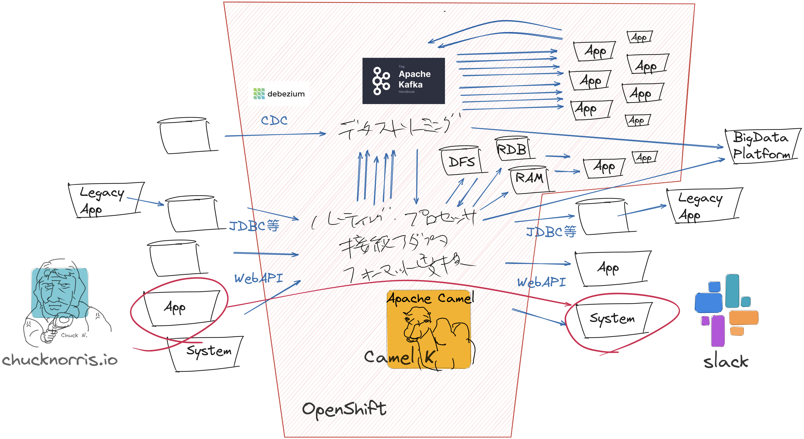

= Talking Bot on OpenShift

== 初めに

こちらには、CamelKの超軽量ハンズオン#1 Talking Bot on OpenShiftのマテリアルを置いています。

本ハンズオンでは、
ランダムに文章を生成してくれるWeb API(ここではchucknorris.ioを使用)をSourceとして、定期的に文章を受け取って、Chatアプリ(ここではSlackを使用)に連携する(Botで喋らせる)統合処理をCamel Kで作っていきます。

 

無償でOpenShiftを試せるOpenShift Sandbox、端末(今回はLinuxを使用)、Slackのみで実施できますが、それぞれの準備方法などについては、まだ作成中です。

Camel Kというのは、
Apache Camelベースの統合処理のフレームワークであり、Kubernetes上で実行されます。（語弊があるかもしれませんが、KubernetesネイティブのApache Camelフレームワークみたいなものという理解です）

開発した統合フローは、
Kubernetes上に簡単にデプロイできるように設計されており、自動スケーリングや高可用性の高い統合処理の運用を実現することができます。

Camel Kを使えば、以下のように様々な種類の統合処理を実現できます。

 

今回は、ETL的に左から右へ流すだけですが、Kafkaに流して、多くのアプリケーションからSourceのデータを利用させるといったことも容易に実現できます。

具体的な開発作業としては、
処理フローの全体的な流れを記載するKamelet Binding、Kamelet(ベースは提供されている)、SlackのTokenや変換処理を記述する外部ファイルを作っていきます。

 

Kamelet Binding、KamaletはCamel3からの新概念になりますが、個々の処理ロジックはKameletにカプセル化、Kamelet BindingでKamaletを組み合わせて、処理フローを作るという建付けになっています。

KameletとKamelet Bindingは、KubernetesネイティブでOpenShiftにシームレスにデプロイができるという機能的な良さがあると共に、処理ロジックの分類方法の観点でも、再利用性が高まることが期待できるブリリアントなデザインの予感はあります。

== ハンズオンの流れ

半完成品を説明しながら、追加、修正を加えて完成させていきます。

- semi-finish1
出力はログ出力、OpenShiftへのApply用のアノテーションも入ってません

- semi-finish2
tokenとSlackのRoomIDを入れるだけで、OpenShiftにApply可能なバージョン

== Executing at local

Under Construction
JBanbを利用します。

== Deployment to OpenShift

Under Construction
全ファイルをocコマンドでOpenShiftに投入
